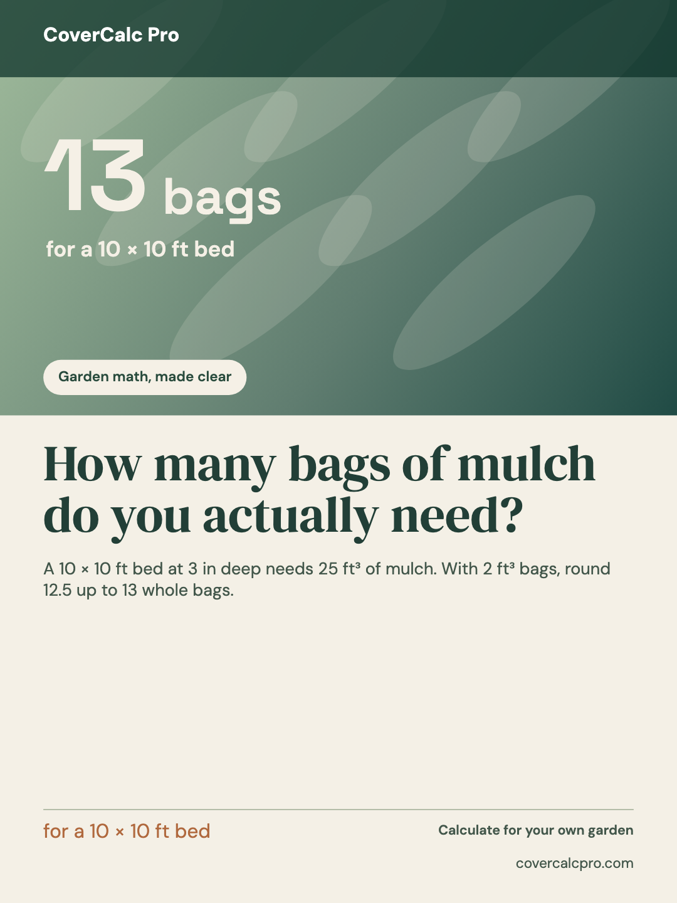
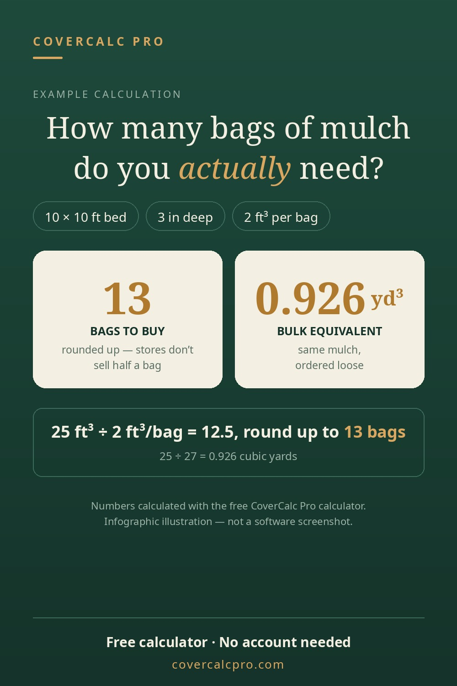

# Social Post Image Maker

**One useful idea. Four platform-ready image layouts.**

Social Post Image Maker is a free, local-first tool for turning a *real fact, lesson, comparison, or product insight* into an image worth saving. Write once, choose a visual direction, and export a newly composed image for Pinterest, Instagram, Lemon8, or Facebook. It is an image composer, not an auto-posting bot or a promise of reach.

The repository keeps its original `aspectory` URL so previously shared studio links continue to work; the public product name describes what the tool does.

**[Try the live studio](https://lydiatools.github.io/aspectory/)** · **[中文版：出海社媒配图助手](https://lydiatools.github.io/aspectory/zh.html)** · [中文说明](README.zh-CN.md)

   

## What it does

- **Four distinct styles:** Field notes, Photo story, Data sheet, and Bright poster. Each is rendered from the same content with its own typography, hierarchy, and color system.
- **Four export presets:** Pinterest 1000×1500, Instagram 1080×1350, Lemon8 1080×1440, and Facebook 1080×1080. Changing destinations redraws the layout; it does not crop the previous image.
- **Real image files:** Live Canvas preview, individual PNG/JPEG exports, or one ZIP containing four separately rendered platform PNGs in the chosen style.
- **Your own photo, if you want one:** Photo story can use a local PNG, JPEG, or WebP. Without a photo, the key figure becomes the lead visual on a clearly graphic background.
- **English and Chinese interface:** Switch languages without deleting the copy you are writing. The canvas accepts English or Chinese text.
- **A Chinese starting point:** Chinese browsers open with a Chinese interface and sample; the shareable [`zh.html` page](https://lydiatools.github.io/aspectory/zh.html) has a Chinese title and preview for Chinese-language posts. Language switching changes only the untouched sample and preserves your own draft.
- **Chinese controls for overseas posts:** Write English copy in the Chinese interface when that is the language your audience reads. The tool lays out the text you enter; it does not translate it.
- **Local-first by design:** No account, backend, API key, upload, analytics script, or automatic publishing. Your draft is saved in this browser's local storage; the optional photo remains in memory for the current session. The Latin font files are bundled with the site.

## Try it

1. Open the [live studio](https://lydiatools.github.io/aspectory/) or run it locally.
2. Replace the CoverCalc Pro example with your own **verified** headline, context, key figure, and source.
3. Choose a visual style and a destination. Add your own photo if you choose Photo story.
4. Check the preview. Download one PNG/JPEG, or use **All 4 PNGs · ZIP** for every destination. Preview the result on each platform before publishing.

Made an image with it? [Tell me which platform and style you tried](https://github.com/LydiaTools/aspectory/issues/new?template=use-feedback.yml), especially if text clipped or an export did not fit. The feedback form is bilingual and requires a GitHub sign-in; you can describe the problem without sharing private draft content.

```bash
git clone https://github.com/LydiaTools/aspectory.git
cd aspectory
npm install
npm run dev
```

Build and test with `npm run build` and `npm test`. The production bundle uses relative paths so it also works below a GitHub Pages repository path.

| Destination | Image export | Why this preset |
| --- | ---: | --- |
| Pinterest | 1000 × 1500 · 2:3 | Pinterest [recommends 2:3](https://help.pinterest.com/en/business/article/pin-performance-and-distribution) for quality Pins. |
| Instagram feed | 1080 × 1350 · 4:5 | A vertical feed composition preset. Check the app's current crop before publishing. |
| Lemon8 | 1080 × 1440 · 3:4 | Lemon8's [creator guidance](https://www.lemon8-app.com/@lemon8_singapore/7215813901554909698) recommends 3:4 photos. |
| Facebook Page | 1080 × 1080 · 1:1 | A square feed composition preset; Facebook may reformat images in its own UI. |

These are export choices, not universal platform requirements. They do not predict distribution or click-through rate.

## Where the visual idea came from

The owner liked a Muse-made CoverCalc Pro daily brief and a related Pinterest infographic. That led to the **Field notes** direction: restrained color, editorial type, a verifiable number, and a visible source. The rendering code and layouts were built independently for this project. The original Muse-produced Pin is included below as a visual reference, **not** as an output of this tool, software screenshot, published Pin, or engagement claim.



The sample is a 1000×1500 image delivered in the owner's Muse workspace on 2026-10-07. Its SHA-256 is `f4f4a25909f838554c5b801ae8e6a60a29008133b01efeb2d02d4b03809c7bc1`. See [example provenance](docs/examples/PROVENANCE.md). The demonstration's 13-bag calculation has stated inputs: 10×10 ft, 3 in depth, 2 ft³ per bag; 25 ft³ ÷ 2 = 12.5, rounded up to 13 whole bags. This is sample content for layout testing, not evidence of a live campaign.

The Lemon8 Photo story screenshot uses a CoverCalc Pro garden refresh **concept image**, not a photograph of a completed customer job. See [screenshot provenance](docs/screenshots/PROVENANCE.md).

## Boundaries

Social Post Image Maker composes graphics from your copy and optional photo. It **does not** synthesize photorealistic images from a prompt, fact-check your claims, schedule or publish posts, or guarantee that an image will perform well. Text that exceeds a layout may be shortened in the export; the editor warns you so you can trim it. When a caption, metric, or image needs a source, check it before posting. Photos you add should be yours or licensed for the use you intend.

## Development

The app is a small Vite site with a Canvas 2D renderer in [`src/render.js`](src/render.js), UI wiring and bilingual copy in [`src/app.js`](src/app.js), and a local ZIP builder for batch exports. There is no server component. Platform dimensions and composition styles are independent, so more destinations or styles can be added without copying an entire page. The code is MIT licensed; the Muse example image and brand assets are provided as references and are not automatically covered by the code license. Bundled fonts retain their SIL Open Font License terms.

Ideas and focused pull requests are welcome—especially typography testing on different devices, accessibility improvements, and new layouts grounded in real user content.
