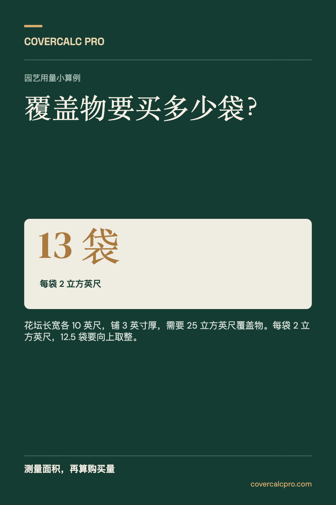
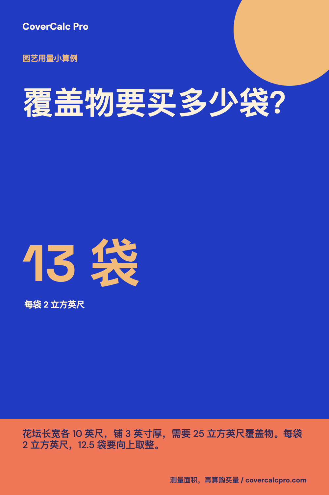
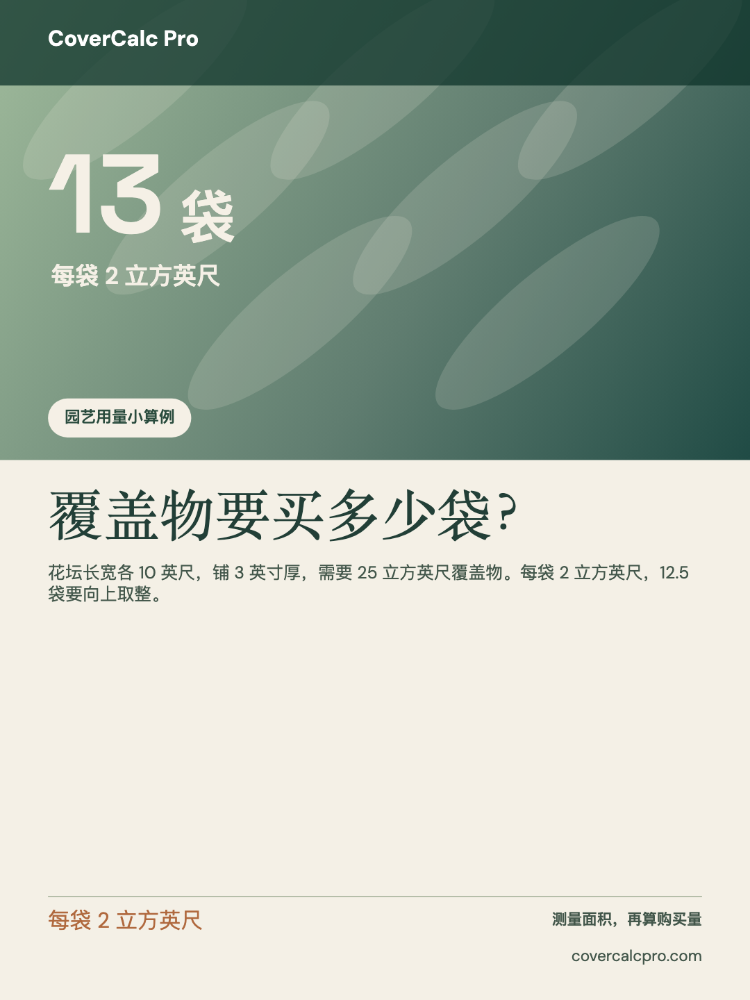
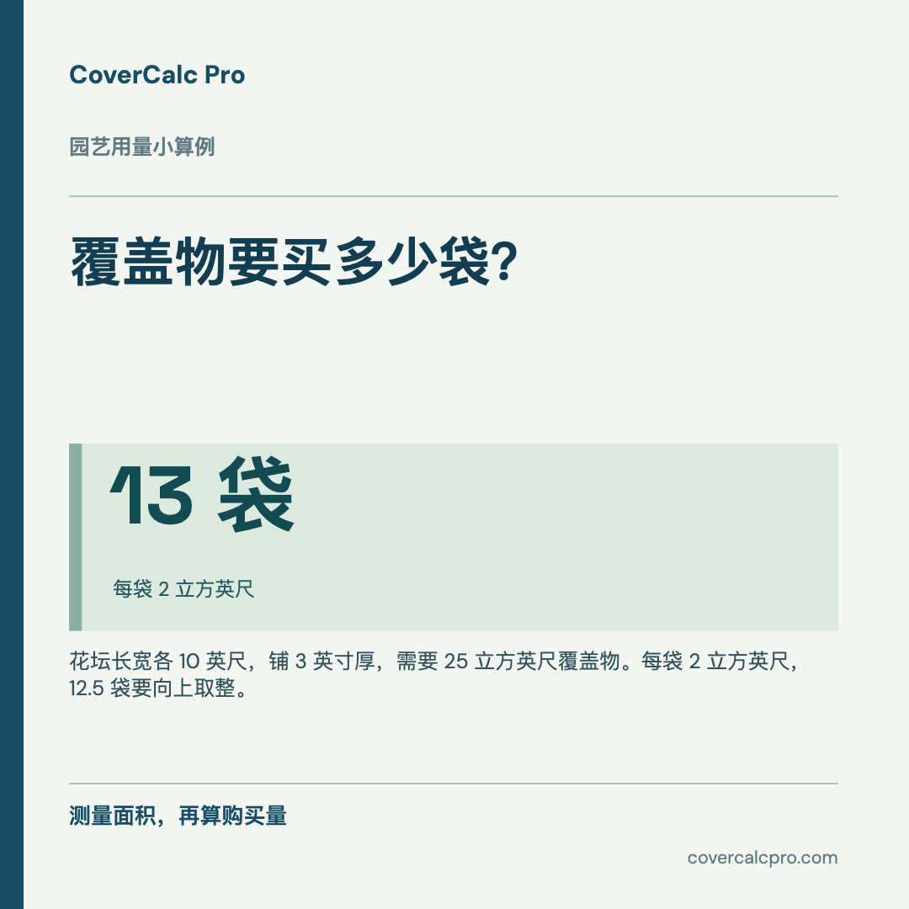

# 出海社媒配图助手

**一份内容，分别做好 Pinterest、Instagram、Lemon8、Facebook 的配图。**

出海社媒配图助手（英文名 Social Post Image Maker）面向想在海外平台发图的中文创作者。输入标题、事实说明、关键数字和来源，选择版式，然后分别导出 Pinterest、Instagram、Lemon8、Facebook 的图片。它会重新排版，不是把同一张图粗暴裁切。仓库地址沿用早期代号 `aspectory`，避免已分享的体验链接失效。

**[打开中文版](https://lydiatools.github.io/aspectory/zh.html)** · [English README](README.md)

   

## 功能

- 四种风格：田野笔记、照片叙事、数据手册、醒目海报。
- 四种画布：Pinterest 1000×1500、Instagram 1080×1350、Lemon8 1080×1440、Facebook 1080×1080。
- 实时预览，单张下载 PNG/JPEG，或把四个平台分别排版的 PNG 一次打包下载为 ZIP。
- 可上传自己的照片；不上传到服务器。没有照片时，用明显是图形的背景突出所填的关键数字。
- 中英文界面；切换界面语言不会覆盖正在编辑的文案。
- 中文浏览器首次打开默认中文界面和中文示例；分享 [`zh.html`](https://lydiatools.github.io/aspectory/zh.html) 链接可让接收者直接看到中文标题、操作界面和中文分享卡片。中文界面可直接输入英文，制作面向海外读者的配图；工具不会自动翻译。切换语言只转换未修改的示例，不会翻译或覆盖你自己写的内容。
- 无需账号、API Key 或后端；草稿只保存在当前浏览器的本地存储。

## 上手

在线打开 [出海社媒配图助手中文版](https://lydiatools.github.io/aspectory/zh.html)，把示例内容换成自己的真实资料，选择风格和平台，检查预览后下载单张图片，或点击「四平台 PNG 打包下载」。如果面向英语读者，就在中文界面里填写英文内容。发布前请在目标平台再次查看实际裁切效果。

用过之后，欢迎通过[中英文反馈表](https://github.com/LydiaTools/aspectory/issues/new?template=use-feedback.yml)说说你做的是哪个平台、用了什么版式，以及哪里不好用。提交需要登录 GitHub；无需公开自己的私有文案。

```bash
git clone https://github.com/LydiaTools/aspectory.git
cd aspectory
npm install
npm run dev
```

构建与测试：`npm run build`、`npm test`。

## 关于 Muse 示例图

项目附带一张作者在 Muse 工作区制作的 CoverCalc Pro 园艺信息图，用作**视觉参考**。它不是本工具的生成结果、软件截图、已发布帖子的证明或效果数据。图片和来源记录见 [`docs/examples/`](docs/examples/)。四套布局及渲染代码是为本项目独立编写的。

Lemon8 的照片叙事示例使用 CoverCalc Pro 园艺改造**概念图**，并非客户工程竣工实拍。截图来源见 [`docs/screenshots/PROVENANCE.md`](docs/screenshots/PROVENANCE.md)。

## 能力边界

当前版本是**内容排版与图片生成工具**，并非输入一句话就生成写实照片的 AI 模型；也不会自动发布、验证事实或保证流量。过长的文字可能被缩短，界面会提示；数字、配图和来源应由发布者核实。代码采用 MIT 许可证，Muse 示例图和品牌素材不自动包含在代码许可证内。
