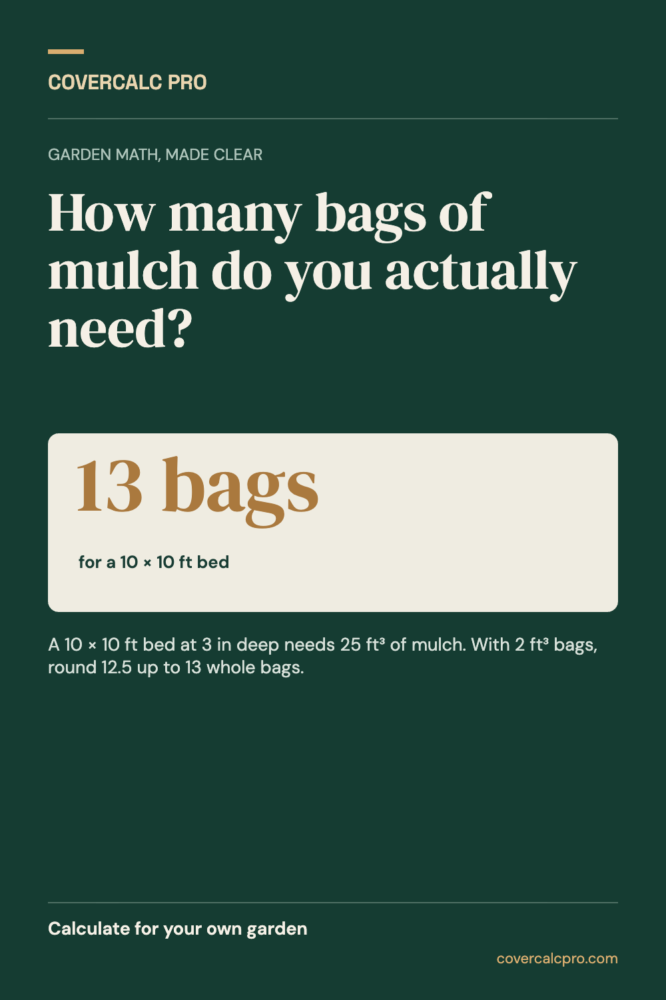
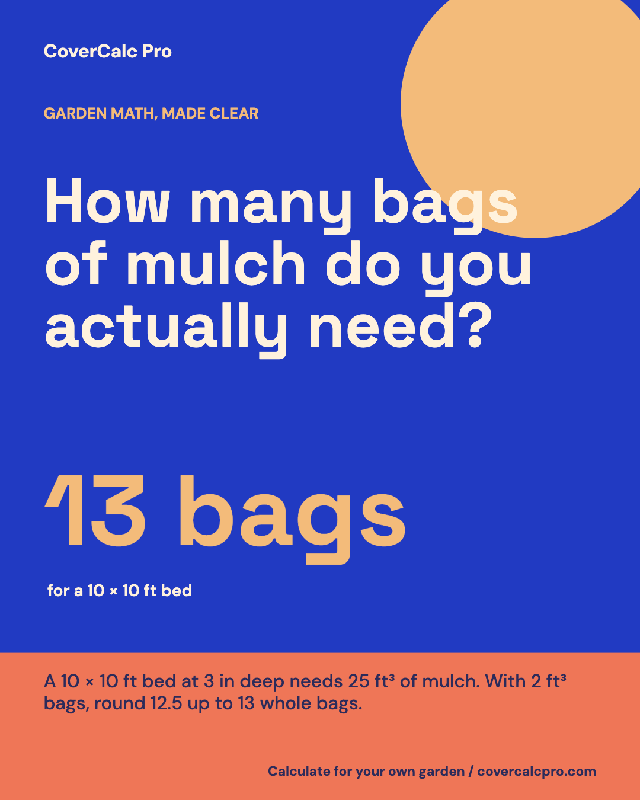
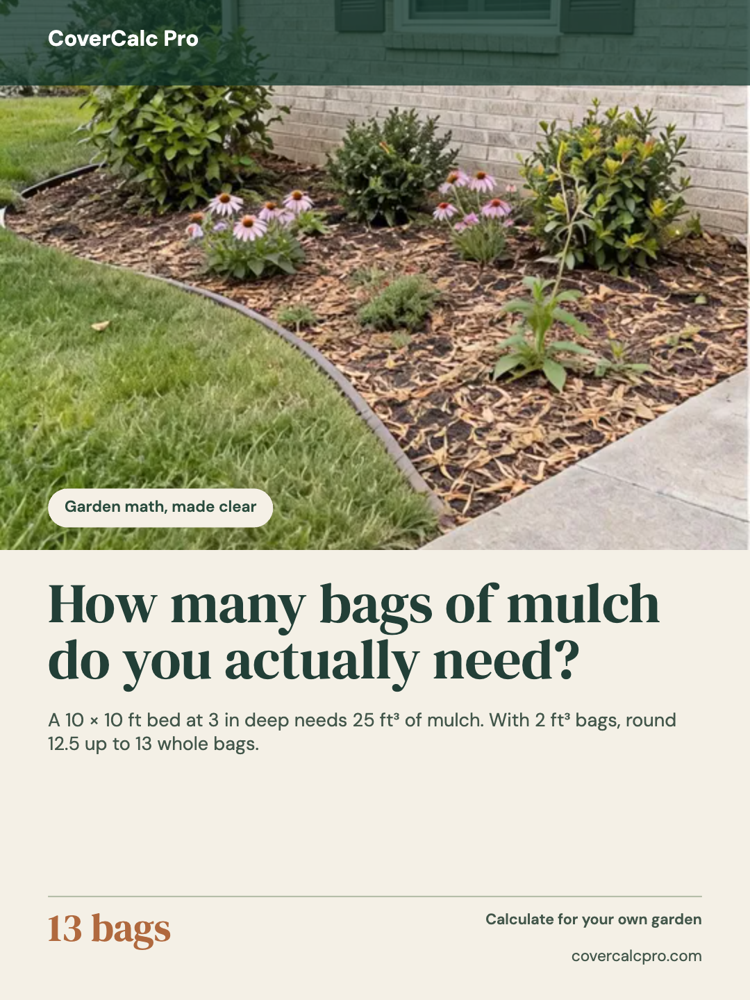
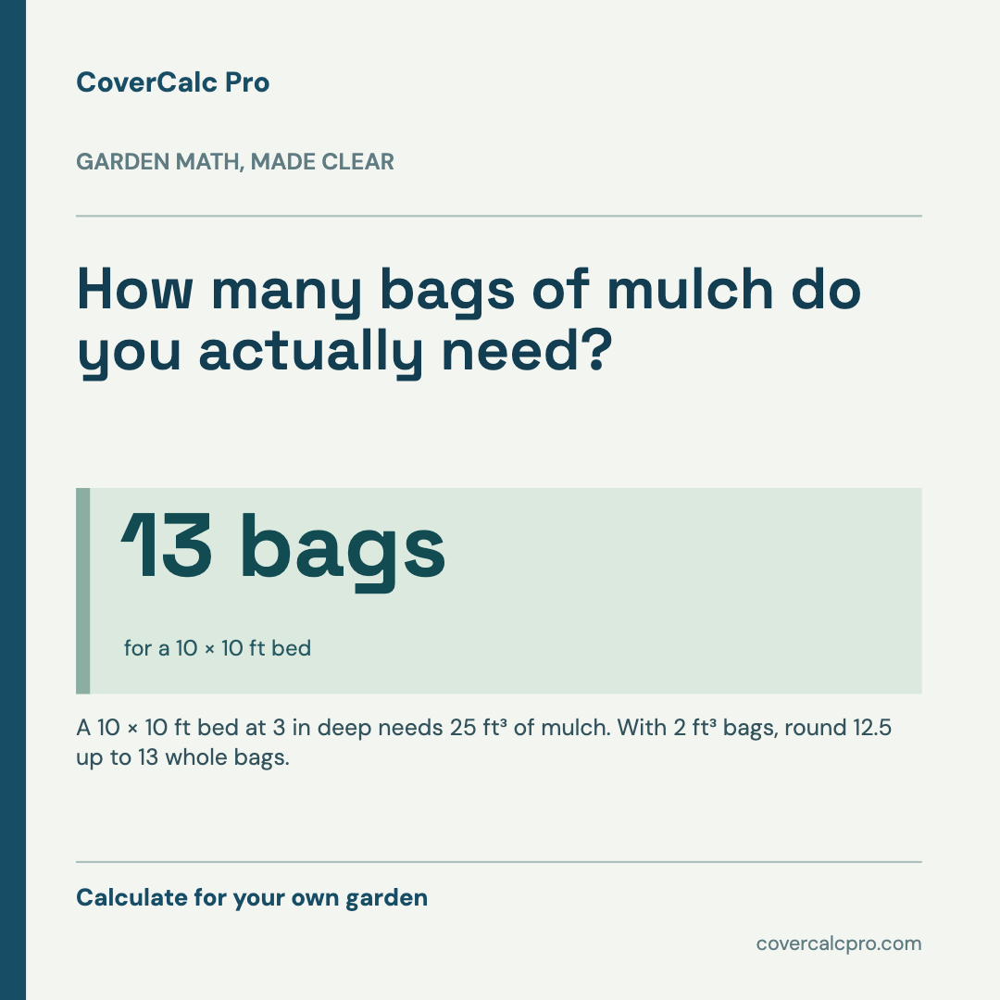

# Aspectory

**把一个真实、有用的观点，做成适合四个平台的图片。**

Aspectory 是本机运行的社媒图片制作工具。输入标题、事实说明、关键数字和来源，选择版式，然后分别导出 Pinterest、Instagram、Lemon8、Facebook 的图片。它会重新排版，不是把同一张图粗暴裁切。

**[直接体验](https://lydiatools.github.io/aspectory/)** · [English README](README.md)

   

## 功能

- 四种风格：田野笔记、照片叙事、数据手册、醒目海报。
- 四种画布：Pinterest 1000×1500、Instagram 1080×1350、Lemon8 1080×1440、Facebook 1080×1080。
- 实时预览，单张下载 PNG/JPEG，或把四个平台分别排版的 PNG 一次打包下载为 ZIP。
- 可上传自己的照片；不上传到服务器。没有照片时使用明显是图形的背景。
- 中英文界面；切换界面语言不会覆盖正在编辑的文案。
- 无需账号、API Key 或后端；草稿只保存在当前浏览器的本地存储。

## 上手

在线打开 [Aspectory](https://lydiatools.github.io/aspectory/)，把示例内容换成自己的真实资料，选择风格和平台，检查预览后下载单张图片，或点击「四平台 PNG 打包下载」。发布前请在目标平台再次查看实际裁切效果。

```bash
git clone https://github.com/LydiaTools/aspectory.git
cd aspectory
npm install
npm run dev
```

构建与测试：`npm run build`、`npm test`。

## 关于 Muse 示例图

项目附带一张作者在 Muse 工作区制作的 CoverCalc Pro 园艺信息图，用作**视觉参考**。它不是 Aspectory 生成结果、软件截图、已发布帖子的证明或效果数据。图片和来源记录见 [`docs/examples/`](docs/examples/)。Aspectory 的四套布局及渲染代码是为本项目独立编写的。

Lemon8 的照片叙事示例使用 CoverCalc Pro 园艺改造**概念图**，并非客户工程竣工实拍。截图来源见 [`docs/screenshots/PROVENANCE.md`](docs/screenshots/PROVENANCE.md)。

## 能力边界

当前版本是**内容排版与图片生成工具**，并非输入一句话就生成写实照片的 AI 模型；也不会自动发布、验证事实或保证流量。过长的文字可能被缩短，界面会提示；数字、配图和来源应由发布者核实。代码采用 MIT 许可证，Muse 示例图和品牌素材不自动包含在代码许可证内。
